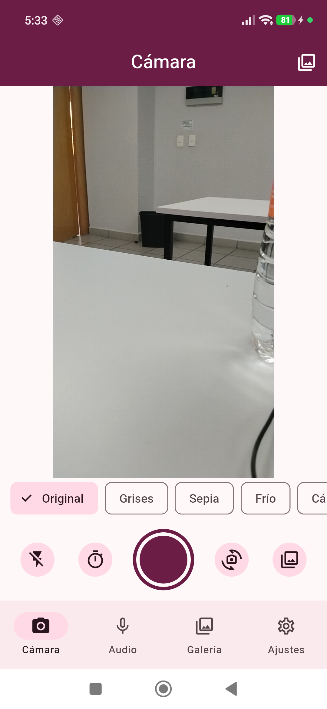
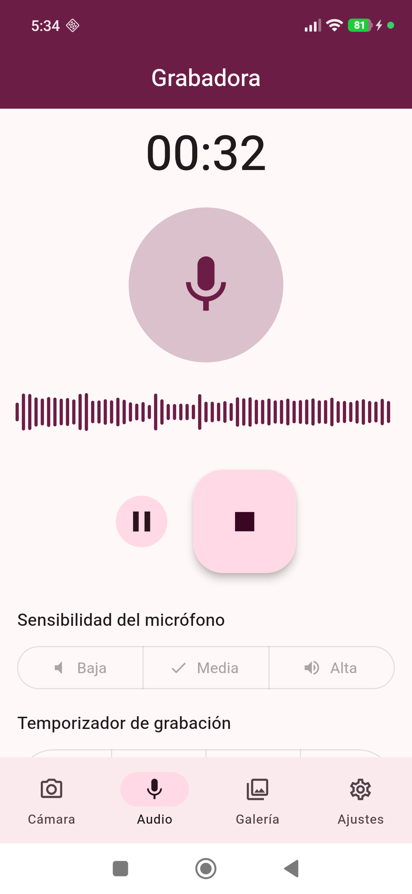
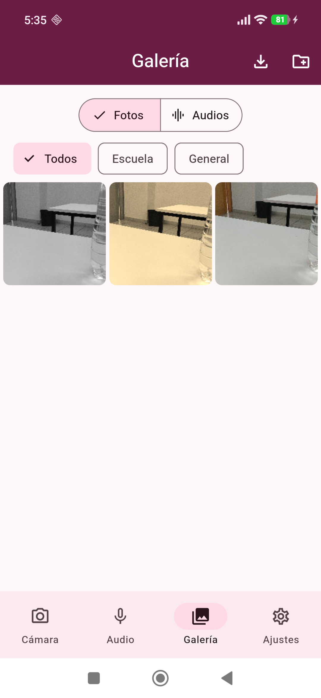
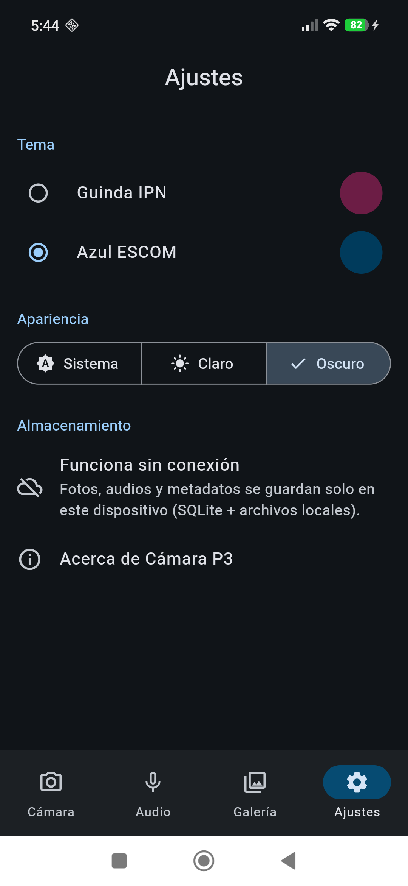
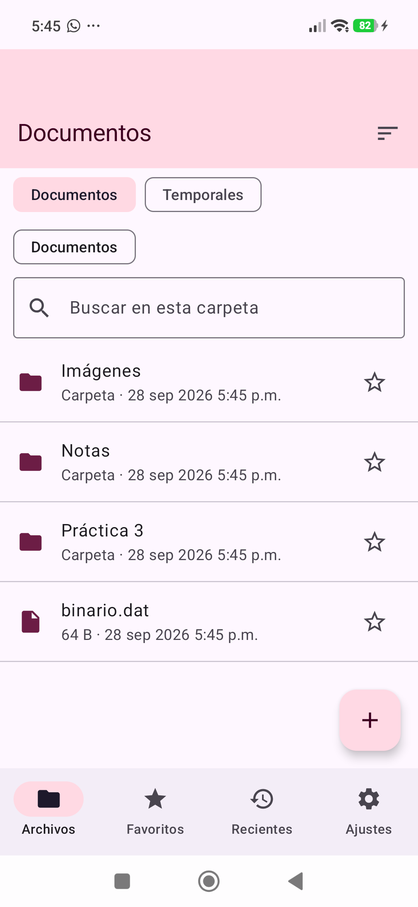
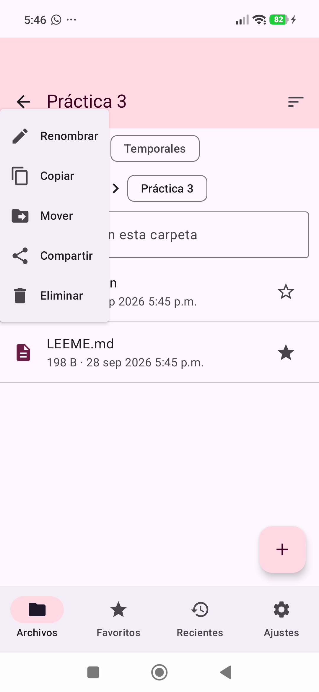
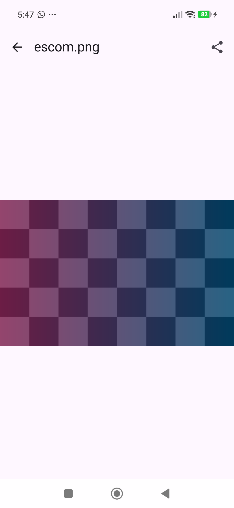
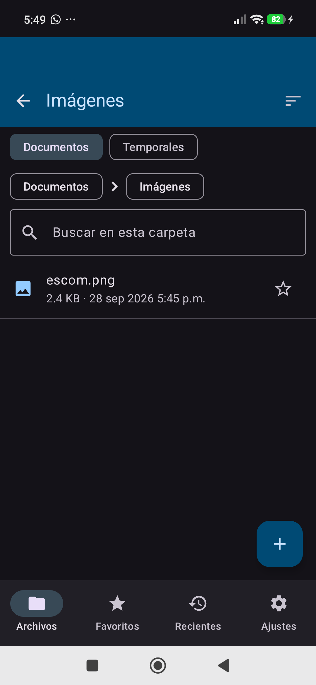

# Práctica 3 — Aplicaciones Nativas

---

## Portada

- **Institución:** Instituto Politécnico Nacional — Escuela Superior de Cómputo
- **Asignatura:** Desarrollo de aplicaciones móviles nativas
- **Profesor:** Gabriel Hurtado Avilés
- **Grupo:** 7CV4
- **Fecha de entrega:** lunes 28 de septiembre de 2026

| Integrante | Boleta |
|---|---|
| Jesús Ángel González Arellano | 2022630690 |
| David Alexis Hernandez Gonzalez | 2024630227 |
| Javier de Jesus Gamez Rosas | 2022630007 |
| Luis Angel Agustin Fuentes | 2024630134 |

---

## Estructura del repositorio

```text
Practica3/
├── README.md                  Este informe
├── INSTRUCTIVO_MACOS.md       Paso a paso para compilar y ejecutar en macOS (Xcode + simulador)
├── REPARTO_COMMITS.md         División de tareas y commits entre los 4 integrantes
├── CHECKLIST.md               Verificación final antes de entregar
├── .github/workflows/         Compilación iOS automática en un runner macOS (GitHub Actions)
├── ej1-entorno/               Ej. 1: comparativa de PCs, guía de instalación, bitácora, HolaMundo
├── ej2-gestor-ios/            Ej. 2: Gestor de Archivos (Swift + SwiftUI)
├── ej3-camara-ios/            Ej. 3: Cámara y Micrófono (Swift + AVFoundation + Core Data)
├── ej4-flutter-camara/        Ej. 4: Cámara y micrófono multiplataforma (Flutter)
├── ej5-kmp-gestor/            Ej. 5: Gestor de archivos multiplataforma (Kotlin Multiplatform)
└── binarios/                  APK (Android) y .app del simulador (iOS)
```

---

## Resumen

Desarrollamos cuatro aplicaciones que funcionan sin conexión e implementan los
temas Guinda IPN y Azul ESCOM en modo claro y oscuro. Además, instalamos un
entorno macOS virtualizado con Docker para compilar y probar en el simulador
de iPhone. Ningún integrante tiene Mac ni iPhone, así que el entorno se
instaló en la PC de David Alexis Hernandez Gonzalez, la de mejores especificaciones, y trabajamos
juntos sobre ella en videollamada (ver bitácora).

| Ejercicio | Tecnología | Opción | Plataformas | Documentación |
|---|---|---|---|---|
| 1. Entorno macOS | MacOS-Docker (Ventura 13) + Xcode 15.2 | — | macOS | [ej1-entorno](ej1-entorno/guia-instalacion.md) |
| 2. Gestor de archivos | Swift 5, SwiftUI + UIKit, UserDefaults | — | iOS (+ Mac Catalyst opcional) | [ej2-gestor-ios](ej2-gestor-ios/README.md) |
| 3. Cámara y micrófono | Swift 5, AVFoundation, Core Data | — | iOS | [ej3-camara-ios](ej3-camara-ios/README.md) |
| 4. Multiplataforma | Flutter 3.24 (Dart), Provider, sqflite | **B: cámara/micrófono** | Android + iOS | [ej4-flutter-camara](ej4-flutter-camara/README.md) |
| 5. Multiplataforma | Kotlin 2.0.21, Compose Multiplatform, SQLDelight | **A: gestor de archivos** | Android + iOS | [ej5-kmp-gestor](ej5-kmp-gestor/README.md) |

---

## Introducción

La práctica compara tres formas de hacer apps que usan recursos del
dispositivo:

1. **Nativo de Apple (Ej. 2 y 3):** Swift y SwiftUI, con acceso directo a
   FileManager, Quick Look, AVFoundation y Core Data.
2. **Flutter (Ej. 4):** un solo código en Dart que dibuja su propia interfaz.
   El acceso al hardware se hace con plugins.
3. **Kotlin Multiplatform (Ej. 5):** la lógica (y aquí también la interfaz,
   con Compose Multiplatform) se comparte en `commonMain`, y lo específico de
   cada sistema se implementa con `expect`/`actual`.

Como el SDK de iOS solo existe en macOS, el Ejercicio 1 prepara ese entorno
con el repositorio `gabrielhuav/MacOS-Docker`. Ese repositorio instala macOS
Ventura sobre QEMU/KVM dentro de un contenedor.

**Estrategia de trabajo.** Para aprovechar al máximo las sesiones en la VM,
que es lenta, el código se escribió y se validó antes en Linux:

- La parte Android de los Ej. 4 y 5 se compiló, se probó con pruebas
  automáticas y se ejecutó en un dispositivo o emulador.
- El código Swift se revisó en sintaxis con `swiftc -parse` y se compila en un
  runner macOS de GitHub Actions.
- En la VM solo quedó compilar para el simulador, ejecutar y tomar capturas.

---

## Ejercicio 1: Instalación del entorno macOS

### 1.1 Identificación del equipo
La comparativa completa está en [`ej1-entorno/comparativa-pcs.md`](ej1-entorno/comparativa-pcs.md).
**Equipo elegido:** PC de David Alexis Hernandez Gonzalez (2024630227): «CPU», «RAM», «disco».
Se eligió porque «justificación». Ningún integrante tiene una Mac física.

### 1.2 Trabajo en equipo
La bitácora de sesiones está en [`ej1-entorno/bitacora.md`](ej1-entorno/bitacora.md).
El reparto de tareas y commits está en [`REPARTO_COMMITS.md`](REPARTO_COMMITS.md).

### 1.3 y 1.4 Instalación
La guía con capturas está en [`ej1-entorno/guia-instalacion.md`](ej1-entorno/guia-instalacion.md)
y los comandos exactos en [`INSTRUCTIVO_MACOS.md`](INSTRUCTIVO_MACOS.md).

| Componente | Versión instalada |
|---|---|
| Imagen Docker | `sickcodes/docker-osx:latest` (`SHORTNAME=ventura`) |
| Recursos asignados | RAM «n» GB, SMP «n», CORES «n» |
| macOS | Ventura 13.«x» |
| Xcode / SDK iOS | 15.2 / iOS 17.2 |
| Simuladores | iPhone 15, iPad «modelo» |
| Homebrew / CocoaPods / XcodeGen | «versiones» |
| Flutter / JDK | 3.24.0 / Temurin 17 |

**Proyecto de prueba en el simulador**


---

## Ejercicio 2: Gestor de Archivos para iPhone

La descripción técnica completa y la tabla de requisitos están en
[`ej2-gestor-ios/README.md`](ej2-gestor-ios/README.md).

- **Arquitectura:** servicios (`ServicioArchivos`, `CacheMiniaturas`,
  `CarpetasExternas`), un modelo observable (`Preferencias`) y vistas
  SwiftUI. Los controladores de UIKit sin equivalente en SwiftUI
  (`UIDocumentPickerViewController`, `QLPreviewController`,
  `UIActivityViewController`) se envuelven con `UIViewControllerRepresentable`.
- **Sandbox:** solo se navega Documents, Inbox y tmp. Las carpetas externas
  requieren que el usuario las elija, y el permiso se conserva con
  *security-scoped bookmarks*.
- **Persistencia:** favoritos, recientes, última carpeta, orden y tema en
  UserDefaults. Las rutas se guardan **relativas al contenedor**, porque la
  ruta absoluta cambia al reinstalar.
- **Errores:** `ErrorArchivo` da mensajes claros. Los archivos de ejemplo
  `dañada.jpg` y `datos.xyz` sirven para demostrarlo.

**Explorador en tema Guinda (modo claro)**


**Tema Azul ESCOM en modo oscuro**


**Ruta visible en subcarpetas**


**Búsqueda y orden**


**Menú contextual (mantener presionado)**


**Deslizar para eliminar con confirmación**


**Crear carpeta**


**Renombrar**


**Copiar o mover a otra carpeta**


**Visor de texto**


**Imagen con zoom y rotación**


**Vista previa con Quick Look**


**Importar con UIDocumentPickerViewController**


**Compartir con UIActivityViewController**


**Favoritos**


**Recientes**


**Ajustes de tema**


**Orientación horizontal**


**Documents visible en la app Archivos (UIFileSharingEnabled)**


**Manejo de archivo dañado o no soportado**


---

## Ejercicio 3: Cámara y Micrófono para iPhone

La descripción técnica completa está en [`ej3-camara-ios/README.md`](ej3-camara-ios/README.md).

> **Fuente de imágenes (requisito 3.2):** ningún integrante tiene iPhone. El
> código de captura con `AVCaptureSession` está implementado completo, pero
> las pruebas se hicieron en el **simulador**, que no tiene cámara. Ahí se
> usó la **fuente alternativa `PHPickerViewController`** (fototeca), cargada
> con `xcrun simctl addmedia`.

- **Captura:** `ServicioCamara` (sesión, flash, cambio de cámara y captura
  asíncrona con `CheckedContinuation`). Después de disparar, una pantalla de
  revisión aplica filtros de Core Image.
- **Audio:** `ServicioAudio` (AVAudioRecorder con medición, sensibilidad y
  límite con `record(forDuration:)`) y `ReproductorAudio` (AVAudioPlayer).
- **Persistencia:** Core Data con las entidades `Captura` y `Album`. Los
  archivos se guardan en `Documents/Capturas`, visibles en la app Archivos.
  Las miniaturas se guardan en disco y en `NSCache`.

**Aviso sin cámara y fuente alternativa**


**Fototeca (PHPicker)**


**Filtros**


**Grabación con medidor de nivel**


**Sensibilidad y temporizador**


**Galería**


**Editor de imagen**


**Reproductor**


**Álbumes**


**Metadatos: fecha, ubicación y etiquetas**


**Exportar**


**Tema Azul ESCOM en modo oscuro**


---

## Ejercicio 4: Flutter (cámara y micrófono)

La arquitectura, la tabla de plugins con su justificación y las instrucciones
están en [`ej4-flutter-camara/README.md`](ej4-flutter-camara/README.md).

- **Clean Architecture:** `domain` (entidades, contrato y casos de uso, sin
  Flutter), `data` (sqflite, archivos y SharedPreferences) y `presentation`
  (Provider + ChangeNotifier). La composición de dependencias está en un solo
  archivo (`core/inyeccion.dart`).
- **Decisiones:**
  - Provider en lugar de Bloc o Riverpod, porque solo hay dos estados
    globales.
  - Los filtros se definen como matriz de color. Así la vista previa en vivo
    (`ColorFiltered`) y el archivo guardado (paquete `image`) dan exactamente
    el mismo resultado.
  - El procesamiento de imágenes corre en un `Isolate`.
- **Pruebas:** 10 pruebas automáticas (repositorio con SQLite en memoria e
  interfaz) pasan con `flutter test`.

| Android (celular) | iOS (simulador) |
|---|---|
|  |  |
|  |  |
|  |  |
|  |  |

---

## Ejercicio 5: Kotlin Multiplatform (gestor de archivos)

La estructura, la tabla de `expect`/`actual` y las librerías están en
[`ej5-kmp-gestor/README.md`](ej5-kmp-gestor/README.md).

- **Módulo compartido:** `commonMain` contiene el dominio, la persistencia
  (SQLDelight), el estado (`StateFlow`) y **toda la interfaz** (Compose
  Multiplatform con Material 3).
- **expect/actual:** sistema de archivos, driver de SQLite, formato de fecha,
  decodificación de imágenes, compartir, selector de documentos (el
  mecanismo de permisos de cada plataforma), botón atrás y hora.
- **Asincronía:** corrutinas en `Dispatchers.Default`; favoritos y recientes
  son `Flow` de SQLDelight.
- **Pruebas:** 13 pruebas (9 de lógica compartida y 4 de SQLDelight) pasan
  con `./gradlew :composeApp:testDebugUnitTest`.

| Android | iOS (simulador) |
|---|---|
|  |  |
|  |  |
|  |  |
|  |  |

### 5.5 Comparación entre Flutter y Kotlin Multiplatform

| Criterio | Flutter (Ej. 4) | Kotlin Multiplatform (Ej. 5) |
|---|---|---|
| **Lenguaje** | Dart 3.5 | Kotlin 2.0.21 (+ 27 líneas de Swift para el punto de entrada iOS) |
| **Forma de construir la interfaz** | Widgets propios, dibujados por el motor de Flutter (Impeller/Skia); se ve igual en ambos sistemas | Compose Multiplatform (declarativo, igual que Jetpack Compose); en iOS dibuja con Skia. También se podía usar SwiftUI nativo |
| **Acceso a APIs nativas** | Indirecto, mediante plugins (canales de plataforma). Si no existe el plugin, hay que escribir código Kotlin y Swift | Directo: `iosMain` llama a Foundation/UIKit desde Kotlin (NSFileManager, UIActivityViewController) y `androidMain` al SDK de Android |
| **Código compartido** | ≈ 99 % (1 992 líneas de Dart; solo 15 líneas nativas generadas) | ≈ 78 % (1 241 líneas en commonMain contra 135 en androidMain + 179 en iosMain + 27 en Swift) |
| **Tamaño del binario (Android release)** | **56.1 MB** (APK universal con 3 ABI y el motor Flutter; ≈ 20 MB por ABI con `--split-per-abi`) | **1.6 MB** (R8 elimina el código sin uso y no hay motor extra) |
| **Tamaño del binario (iOS, simulador)** | «MB del Runner.app» | «MB del iosApp.app» |
| **Primera compilación en la VM** | «min» | «min» (incluye la descarga de Kotlin/Native) |
| **Curva de aprendizaje** | Baja: un solo lenguaje, recarga en caliente, documentación muy completa | Media-alta: Gradle multiplataforma, `expect`/`actual`, interop con Objective-C (`cinterop`, punteros, `usePinned`) y un proyecto Xcode aparte |
| **Madurez del ecosistema** | Alta: pub.dev tiene plugins mantenidos para cámara, audio y permisos | Buena y en crecimiento: KMP estable desde 2023; Compose para iOS estable desde la versión 1.8 (2025), aunque aquí se usó 1.7 para no cambiar de Kotlin 2.0.21; menos librerías listas para hardware (cámara o audio implican escribir `actual` propios) |
| **Problemas encontrados** | Conflictos de versión de plugins (`record_android`) con Flutter 3.24 y la plantilla de Gradle antigua | Configurar el framework iOS (`-lsqlite3`, `iosX64` para la VM Intel, JDK visible para Xcode) |

**Conclusión argumentada.**

- **Cámara y micrófono → Flutter.** Para una app que depende de hardware
  multimedia, Flutter resultó más adecuado. Los plugins `camera`, `record` y
  `permission_handler` resolvieron en pocas líneas lo que en KMP habría
  requerido escribir dos implementaciones `actual` (CameraX y AVFoundation)
  con interop de Objective-C.
- **Gestor de archivos → KMP.** Para una app centrada en lógica y sistema de
  archivos, KMP fue más natural: el acceso nativo es directo, el binario es
  más de 30 veces más chico y la lógica compartida se prueba en la JVM sin
  dispositivo.
- **En resumen:** si la prioridad es entregar rápido una interfaz idéntica
  con mucho hardware, conviene Flutter. Si importa integrarse con el código
  nativo existente, controlar el tamaño y compartir solo la lógica, conviene
  KMP. «Ajustar con los tiempos reales medidos en la VM».

---

## Pruebas realizadas

| Aplicación | Dónde | Qué se probó | Resultado |
|---|---|---|---|
| Ej. 4 Flutter | Linux (`flutter test`) | 6 pruebas de repositorio + 4 de interfaz | ✅ 10/10 |
| Ej. 4 Flutter | Emulador Android API 33 (release) | Arranque, solicitud de permiso de cámara | ✅ |
| Ej. 4 Flutter | Celular Android «modelo» | Cámara real, filtros, flash, grabación, galería | «✅/❌» |
| Ej. 4 Flutter | Simulador iPhone 15 (iOS 17.2) | Fototeca, grabadora, galería, temas | «✅/❌» |
| Ej. 5 KMP | Linux (JVM) | 9 pruebas de dominio + 4 de SQLDelight | ✅ 13/13 |
| Ej. 5 KMP | Emulador Android API 33 (release, R8) | Arranque, archivos de ejemplo, navegación, migas | ✅ |
| Ej. 5 KMP | Simulador iPhone 15 | Explorador, visores, importar, compartir, favoritos | «✅/❌» |
| Ej. 2 y 3 | Docker `swift:5.10` (`swiftc -parse`) | Sintaxis de todos los archivos Swift | ✅ |
| Ej. 1–5 iOS | GitHub Actions `macos-14` | Compilación para el simulador | «✅/❌ + enlace a la ejecución» |
| Ej. 2 | Simulador iPhone 15 | Ver lista de capturas | «✅/❌» |
| Ej. 3 | Simulador iPhone 15 | PHPicker, filtros, grabación, Core Data | «✅/❌» |
| Todas | Modo avión / sin red | Funcionan sin Internet | «✅» |

### Problemas conocidos
- **Micrófono en la VM:** macOS virtualizado con Docker puede no tener
  entrada de audio. En ese caso las grabaciones del simulador quedan en
  silencio, aunque el flujo funciona completo. En el celular Android sí se
  grabó audio real.
- **Cámara en iOS:** no se probó en un iPhone físico (nadie tiene uno). Se
  usó la fuente alternativa que acepta la práctica.
- «Agregar aquí cualquier bug encontrado durante las capturas (qué pasa,
  cuándo y cómo evitarlo), en lugar de corregirlo a última hora.»

---

## Binarios

| Archivo | Plataforma |
|---|---|
| `binarios/ej4-flutter-camara-android.apk` | Android 7.0+ (API 24) |
| `binarios/ej5-kmp-gestor-android.apk` | Android 7.0+ (API 24) |
| `binarios/GestorArchivos-ios-simulador.zip` | Simulador de iPhone (iOS 16+) |
| `binarios/CamaraMic-ios-simulador.zip` | Simulador de iPhone (iOS 16+) |
| `binarios/ej4-flutter-camara-ios-simulador.zip` | Simulador de iPhone |
| `binarios/ej5-kmp-gestor-ios-simulador.zip` | Simulador de iPhone |

Para instalar un `.app` en el simulador:
`unzip X.zip && xcrun simctl install booted X.app`.

No se generó IPA firmado porque requiere una cuenta de Apple Developer o un
dispositivo. La práctica acepta capturas del simulador.

---

## Bitácora de trabajo

El detalle está en [`ej1-entorno/bitacora.md`](ej1-entorno/bitacora.md).
Responsable del equipo utilizado: David Alexis Hernandez Gonzalez.

---

## Conclusiones

> Cada integrante escribe la suya **en primera persona**: qué entendía antes,
> qué entendió después y qué le sorprendió. Debe ser propia, no una lista
> genérica.

### Jesús Ángel González Arellano
«Conclusión personal: experiencia con iOS y el ecosistema Apple, con el
entorno macOS-Docker y con la comparación Flutter vs KMP.»

### David Alexis Hernandez Gonzalez
«…»

### Javier de Jesus Gamez Rosas
«…»

### Luis Angel Agustin Fuentes
«…»

---

## Referencias (APA)

- Apple Inc. (s.f.). *AVFoundation*. https://developer.apple.com/documentation/avfoundation
- Apple Inc. (s.f.). *Core Data*. https://developer.apple.com/documentation/coredata
- Apple Inc. (s.f.). *FileManager*. https://developer.apple.com/documentation/foundation/filemanager
- Apple Inc. (s.f.). *Human Interface Guidelines*. https://developer.apple.com/design/human-interface-guidelines
- Apple Inc. (s.f.). *QLPreviewController*. https://developer.apple.com/documentation/quicklook/qlpreviewcontroller
- Apple Inc. (s.f.). *Providing access to directories (security-scoped bookmarks)*. https://developer.apple.com/documentation/uikit/view_controllers/providing_access_to_directories
- Flutter. (s.f.). *Guide to app architecture*. https://docs.flutter.dev/app-architecture
- Google. (s.f.). *Material Design 3*. https://m3.material.io
- Hurtado Avilés, G. (s.f.). *MacOS-Docker* [Repositorio]. GitHub. https://github.com/gabrielhuav/MacOS-Docker
- JetBrains. (s.f.). *Compose Multiplatform*. https://www.jetbrains.com/compose-multiplatform/
- JetBrains. (s.f.). *Expected and actual declarations*. https://kotlinlang.org/docs/multiplatform/multiplatform-expect-actual.html
- Cash App. (s.f.). *SQLDelight*. https://sqldelight.github.io/sqldelight/
- sickcodes. (s.f.). *Docker-OSX* [Repositorio]. GitHub. https://github.com/sickcodes/Docker-OSX
- Yonas Kolb. (s.f.). *XcodeGen* [Repositorio]. GitHub. https://github.com/yonaskolb/XcodeGen
