# Práctica 3 — Aplicaciones Nativas

---

## Portada

- **Institución:** Instituto Politécnico Nacional — Escuela Superior de Cómputo
- **Asignatura:** Desarrollo de aplicaciones móviles nativas
- **Profesor:** Gabriel Hurtado Avilés
- **Grupo:** 7CV4
- **Fecha de entrega:** lunes 28 de septiembre de 2026

| Integrante | Boleta |
|---|---|
| Jesús Ángel González Arellano | 2022630690 |
| David Alexis Hernandez Gonzalez | 2024630227 |
| Javier de Jesus Gamez Rosas | 2022630007 |
| Luis Angel Agustin Fuentes | 2024630134 |

---

## Estructura del repositorio

```text
Practica3/
├── README.md                  Este informe
├── .github/workflows/         Compilación iOS automática en un runner macOS (GitHub Actions)
├── ej1-entorno/               Ej. 1: comparativa de PCs y proyecto de prueba HolaMundo
├── ej2-gestor-ios/            Ej. 2: Gestor de Archivos (Swift + SwiftUI)
├── ej3-camara-ios/            Ej. 3: Cámara y Micrófono (Swift + AVFoundation + Core Data)
├── ej4-flutter-camara/        Ej. 4: Cámara y micrófono multiplataforma (Flutter)
├── ej5-kmp-gestor/            Ej. 5: Gestor de archivos multiplataforma (Kotlin Multiplatform)
└── binarios/                  APK de Android de los Ejercicios 4 y 5
```

---

## Resumen

Desarrollamos cuatro aplicaciones que funcionan sin conexión e implementan los
temas Guinda IPN y Azul ESCOM en modo claro y oscuro. Ningún integrante tiene
Mac ni iPhone. Por eso los cinco proyectos iOS se compilaron en un runner
macOS de GitHub Actions (Xcode 15.2), y el Ejercicio 3 se ejecutó en el
simulador de iPhone 17 Pro (iOS 26.5), con capturas de David Alexis Hernandez
Gonzalez. Las apps multiplataforma (Ejercicios 4 y 5) se probaron completas
en un celular Android real, en modo avión.

| Ejercicio | Tecnología | Opción | Plataformas | Documentación |
|---|---|---|---|---|
| 1. Entorno macOS | Comparativa de equipos; compilación iOS en GitHub Actions (Xcode 15.2) | — | macOS | [ej1-entorno](ej1-entorno/comparativa-pcs.md) |
| 2. Gestor de archivos | Swift 5, SwiftUI + UIKit, UserDefaults | — | iOS (+ Mac Catalyst opcional) | [ej2-gestor-ios](ej2-gestor-ios/README.md) |
| 3. Cámara y micrófono | Swift 5, AVFoundation, Core Data | — | iOS | [ej3-camara-ios](ej3-camara-ios/README.md) |
| 4. Multiplataforma | Flutter 3.24 (Dart), Provider, sqflite | **B: cámara/micrófono** | Android + iOS | [ej4-flutter-camara](ej4-flutter-camara/README.md) |
| 5. Multiplataforma | Kotlin 2.0.21, Compose Multiplatform, SQLDelight | **A: gestor de archivos** | Android + iOS | [ej5-kmp-gestor](ej5-kmp-gestor/README.md) |

---

## Introducción

La práctica compara tres formas de hacer apps que usan recursos del
dispositivo:

1. **Nativo de Apple (Ej. 2 y 3):** Swift y SwiftUI, con acceso directo a
   FileManager, Quick Look, AVFoundation y Core Data.
2. **Flutter (Ej. 4):** un solo código en Dart que dibuja su propia interfaz.
   El acceso al hardware se hace con plugins.
3. **Kotlin Multiplatform (Ej. 5):** la lógica (y aquí también la interfaz,
   con Compose Multiplatform) se comparte en `commonMain`, y lo específico de
   cada sistema se implementa con `expect`/`actual`.

Como el SDK de iOS solo existe en macOS, la práctica propone preparar ese
entorno con el repositorio `gabrielhuav/MacOS-Docker`, que instala macOS
Ventura sobre QEMU/KVM dentro de un contenedor.

**Estrategia de trabajo.** Como solo una computadora del equipo cumplía los
requisitos para virtualizar macOS, el código se escribió y se validó antes en
Linux:

- La parte Android de los Ej. 4 y 5 se compiló, se probó con pruebas
  automáticas y se ejecutó en un celular Android.
- El código Swift se revisó en sintaxis con `swiftc -parse` y se compila en un
  runner macOS de GitHub Actions.

---

## Ejercicio 1: Instalación del entorno macOS

### 1.1 Identificación del equipo
La comparativa completa está en [`ej1-entorno/comparativa-pcs.md`](ej1-entorno/comparativa-pcs.md).
**Equipo elegido:** PC de David Alexis Hernandez Gonzalez (2024630227):
Windows 11 Pro 25H2 (64 bits), Intel Core i5-10600KF a 4.10 GHz (6 núcleos /
12 hilos, virtualización VT-x habilitada), 16 GB de RAM, NVIDIA GeForce RTX
3060 (12 GB) y 1.17 TB de disco libre.

Se eligió porque cumple los requisitos del repositorio MacOS-Docker: 16 GB de
RAM, CPU con virtualización y espacio de sobra para macOS, Xcode y los
simuladores (se recomiendan ≥ 50 GB). Por su número de núcleos es la más
adecuada para virtualizar macOS con QEMU/KVM. La PC de Jesús (i5-6200U,
7.6 GB de RAM, 32 GB libres) queda por debajo del mínimo. Ningún integrante
tiene una Mac física.

### 1.2 Entorno utilizado

| Componente | Versión |
|---|---|
| Compilación de verificación | GitHub Actions `macos-14`, Xcode 15.2 (los 5 proyectos iOS) |
| Simulador usado en las capturas del Ej. 3 | iPhone 17 Pro, iOS 26.5 |
| Proyecto de prueba | [`ej1-entorno/HolaMundo`](ej1-entorno/HolaMundo) (SwiftUI, XcodeGen); compila en GitHub Actions |

---

## Ejercicio 2: Gestor de Archivos para iPhone

La descripción técnica completa y la tabla de requisitos están en
[`ej2-gestor-ios/README.md`](ej2-gestor-ios/README.md).

- **Arquitectura:** servicios (`ServicioArchivos`, `CacheMiniaturas`,
  `CarpetasExternas`), un modelo observable (`Preferencias`) y vistas
  SwiftUI. Los controladores de UIKit sin equivalente en SwiftUI
  (`UIDocumentPickerViewController`, `QLPreviewController`,
  `UIActivityViewController`) se envuelven con `UIViewControllerRepresentable`.
- **Sandbox:** solo se navega Documents, Inbox y tmp. Las carpetas externas
  requieren que el usuario las elija, y el permiso se conserva con
  *security-scoped bookmarks*.
- **Persistencia:** favoritos, recientes, última carpeta, orden y tema en
  UserDefaults. Las rutas se guardan **relativas al contenedor**, porque la
  ruta absoluta cambia al reinstalar.
- **Errores:** `ErrorArchivo` da mensajes claros. Los archivos de ejemplo
  `dañada.jpg` y `datos.xyz` sirven para demostrarlo.

El proyecto compila para el simulador de iPhone en GitHub Actions
(Xcode 15.2).

---

## Ejercicio 3: Cámara y Micrófono para iPhone

La descripción técnica completa está en [`ej3-camara-ios/README.md`](ej3-camara-ios/README.md).

> **Fuente de imágenes (requisito 3.2):** ningún integrante tiene iPhone. El
> código de captura con `AVCaptureSession` está implementado completo, pero
> las pruebas se hicieron en el **simulador de iPhone 17 Pro (iOS 26.5)**, que
> no tiene cámara. Ahí se usó la **fuente alternativa
> `PHPickerViewController`** (fototeca).

- **Captura:** `ServicioCamara` (sesión, flash, cambio de cámara y captura
  asíncrona con `CheckedContinuation`). Después de disparar, una pantalla de
  revisión aplica filtros de Core Image.
- **Audio:** `ServicioAudio` (AVAudioRecorder con medición, sensibilidad y
  límite con `record(forDuration:)`) y `ReproductorAudio` (AVAudioPlayer).
- **Persistencia:** Core Data con las entidades `Captura` y `Album`. Los
  archivos se guardan en `Documents/Capturas`, visibles en la app Archivos.
  Las miniaturas se guardan en disco y en `NSCache`.

**Aviso sin cámara y fuente alternativa**

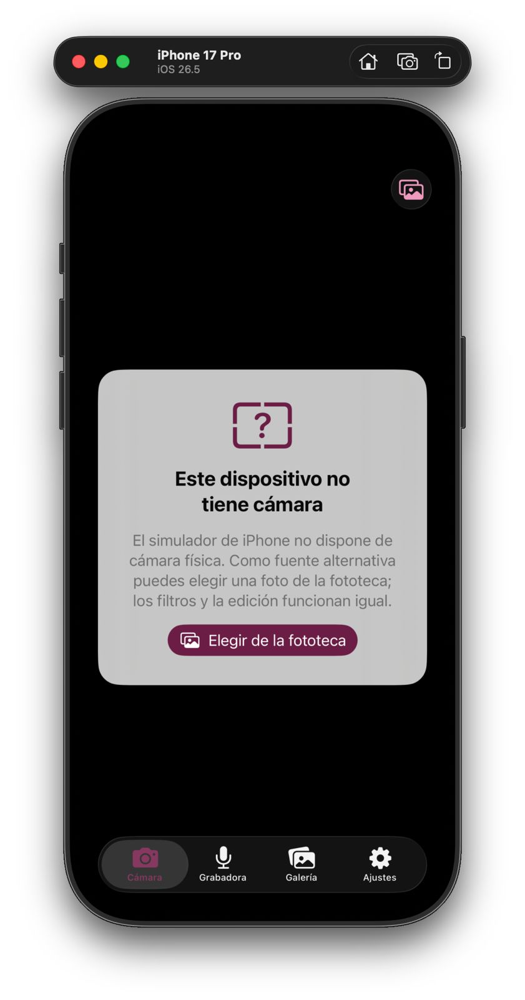

**Fototeca (PHPicker)**

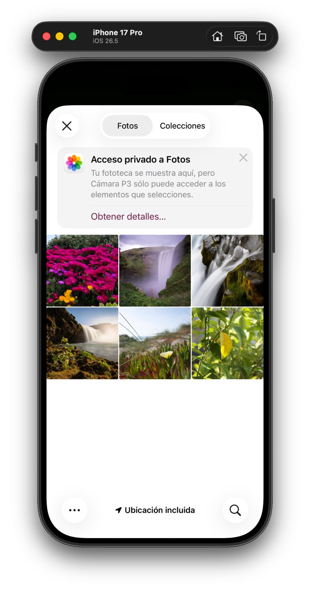

**Revisión de la foto con filtro Noir**

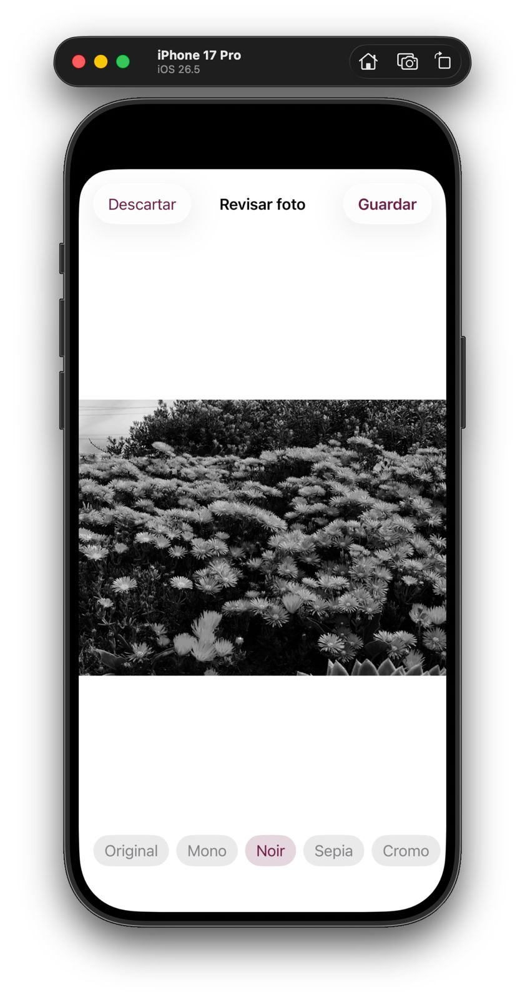

**Filtro Sepia**

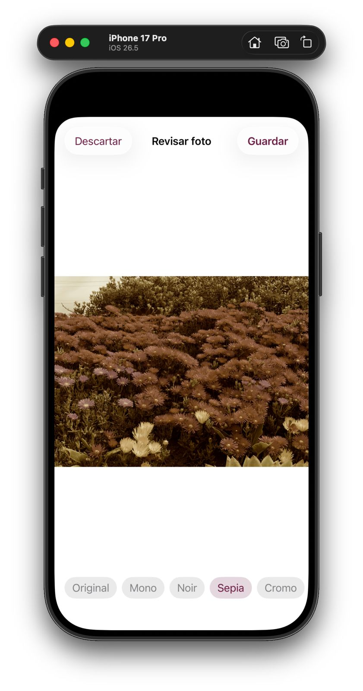

**Permiso de micrófono en tiempo de ejecución**

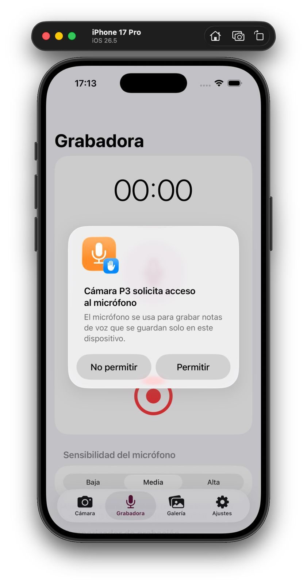

**Grabación con medidor de nivel**

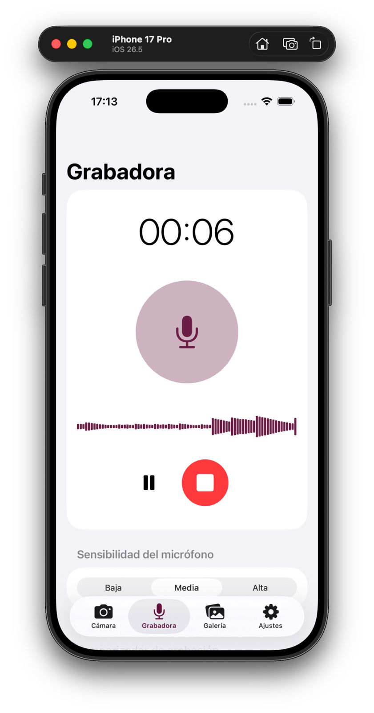

**Grabadora con sensibilidad del micrófono**

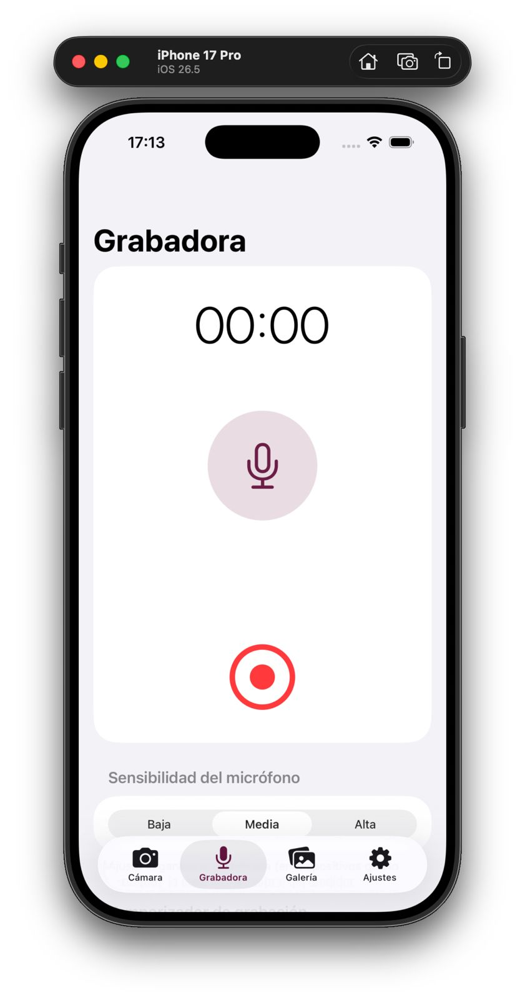

**Galería de fotos**

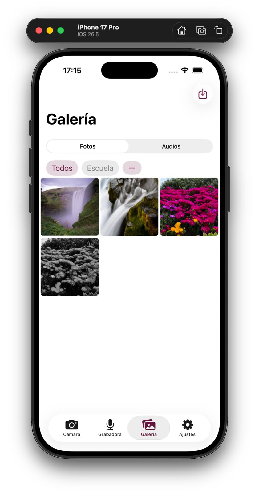

**Galería con una foto guardada**

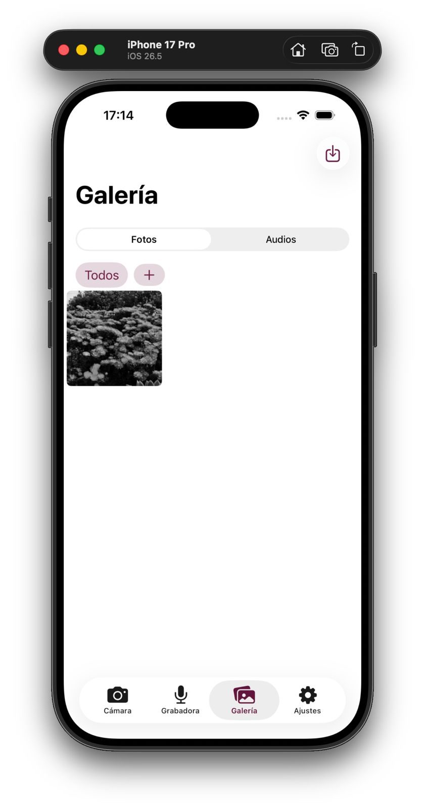

**Galería de audios**

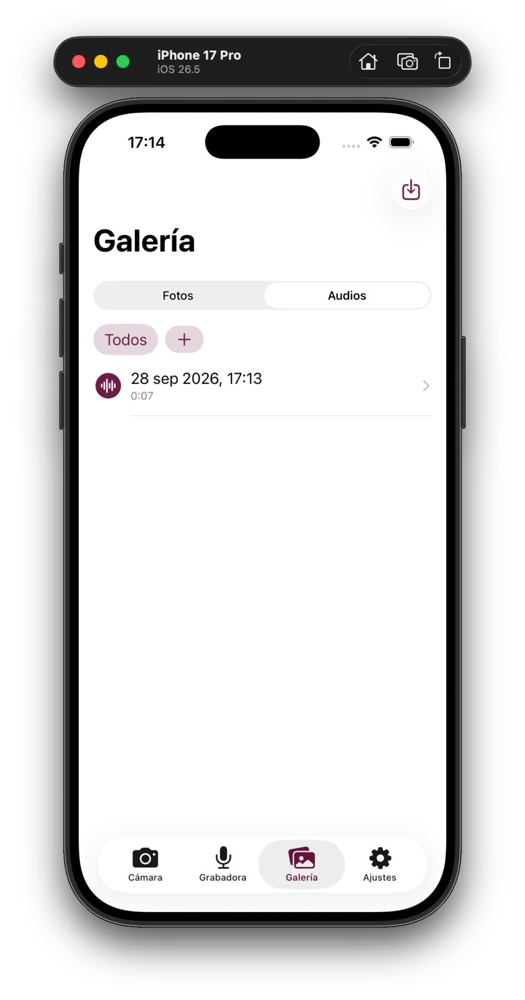

**Reproductor con metadatos**

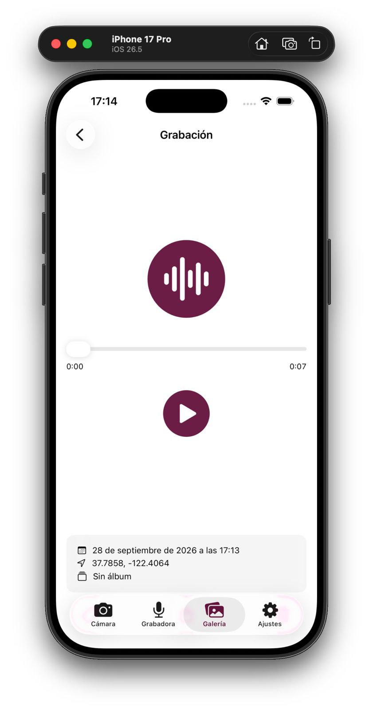

**Álbumes (filtro por el álbum «Escuela»)**

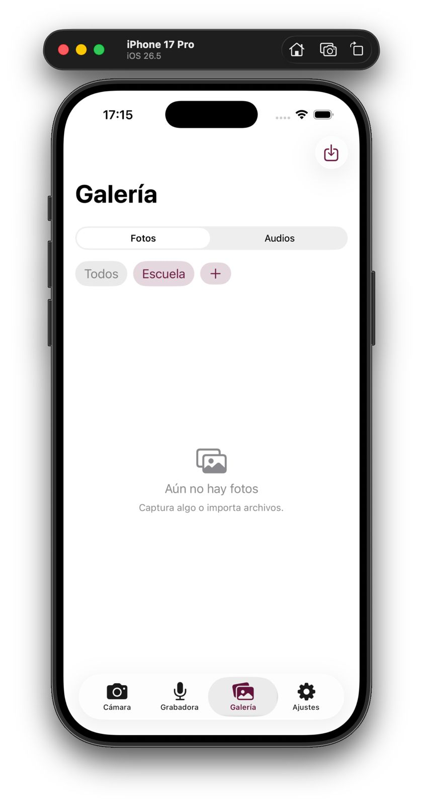

**Metadatos en Core Data: fecha, ubicación, álbum y filtro**

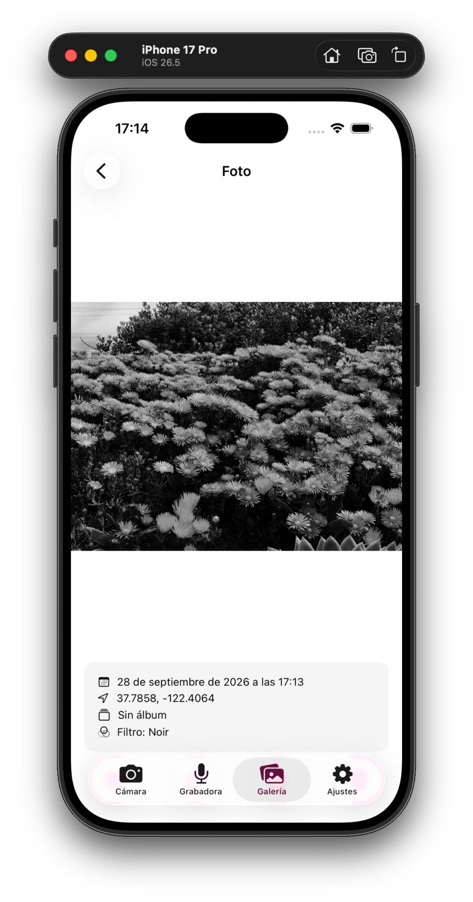

**Importar varias fotos de la fototeca**

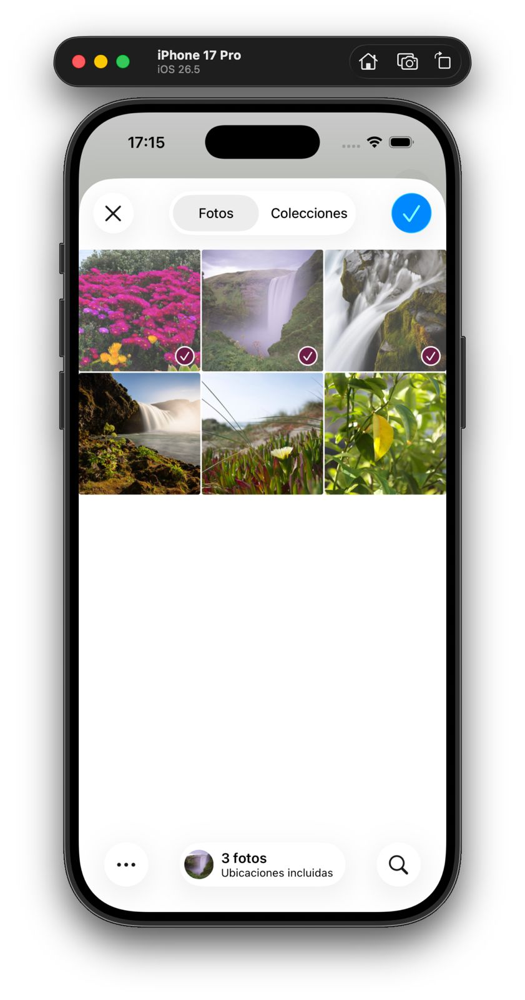

**Selector de la fototeca al importar**

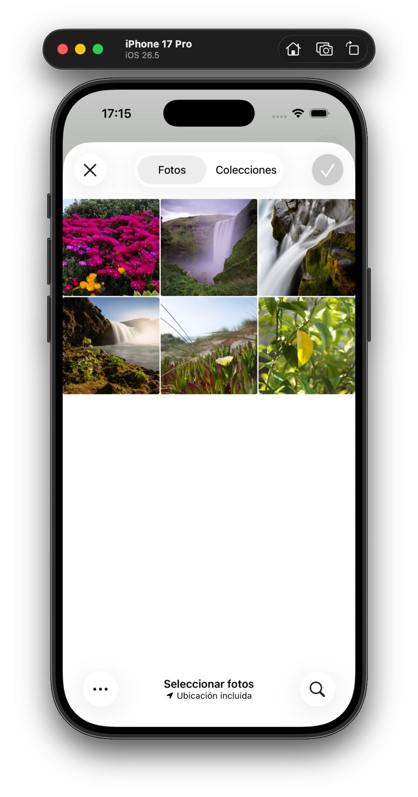

**Tema Azul ESCOM en modo oscuro**

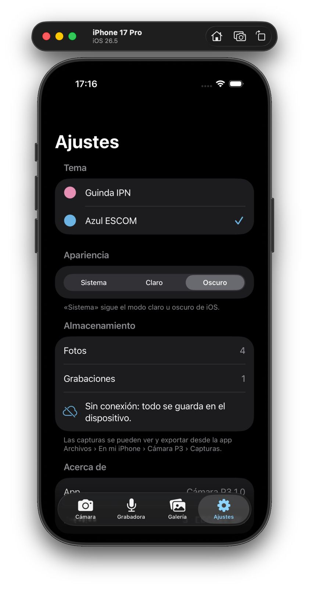

**Tema Guinda IPN en modo claro**

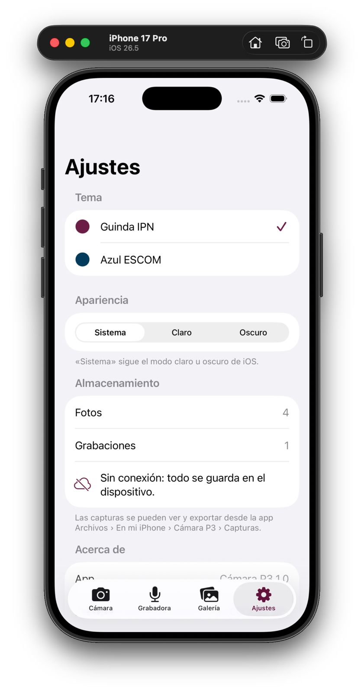

---

## Ejercicio 4: Flutter (cámara y micrófono)

La arquitectura, la tabla de plugins con su justificación y las instrucciones
están en [`ej4-flutter-camara/README.md`](ej4-flutter-camara/README.md).

- **Clean Architecture:** `domain` (entidades, contrato y casos de uso, sin
  Flutter), `data` (sqflite, archivos y SharedPreferences) y `presentation`
  (Provider + ChangeNotifier). La composición de dependencias está en un solo
  archivo (`core/inyeccion.dart`).
- **Decisiones:**
  - Provider en lugar de Bloc o Riverpod, porque solo hay dos estados
    globales.
  - Los filtros se definen como matriz de color. Así la vista previa en vivo
    (`ColorFiltered`) y el archivo guardado (paquete `image`) dan exactamente
    el mismo resultado.
  - El procesamiento de imágenes corre en un `Isolate`.
- **Pruebas:** 10 pruebas automáticas (repositorio con SQLite en memoria e
  interfaz) pasan con `flutter test`.

Capturas en el celular Android (todas están en `ej4-flutter-camara/img/`).
La versión iOS compila en GitHub Actions.

| Cámara con filtros | Grabadora | Galería | Azul ESCOM oscuro |
|---|---|---|---|
|  |  |  |  |

---

## Ejercicio 5: Kotlin Multiplatform (gestor de archivos)

La estructura, la tabla de `expect`/`actual` y las librerías están en
[`ej5-kmp-gestor/README.md`](ej5-kmp-gestor/README.md).

- **Módulo compartido:** `commonMain` contiene el dominio, la persistencia
  (SQLDelight), el estado (`StateFlow`) y **toda la interfaz** (Compose
  Multiplatform con Material 3).
- **expect/actual:** sistema de archivos, driver de SQLite, formato de fecha,
  decodificación de imágenes, compartir, selector de documentos (el
  mecanismo de permisos de cada plataforma), botón atrás y hora.
- **Asincronía:** corrutinas en `Dispatchers.Default`; favoritos y recientes
  son `Flow` de SQLDelight.
- **Pruebas:** 13 pruebas (9 de lógica compartida y 4 de SQLDelight) pasan
  con `./gradlew :composeApp:testDebugUnitTest`.

Capturas en el celular Android (todas están en `ej5-kmp-gestor/img/`). El
framework iOS (`iosX64` e `iosSimulatorArm64`) y la app `iosApp` compilan en
GitHub Actions.

| Documentos | Menú contextual | Visor de imagen | Azul ESCOM oscuro |
|---|---|---|---|
|  |  |  |  |

### 5.5 Comparación entre Flutter y Kotlin Multiplatform

| Criterio | Flutter (Ej. 4) | Kotlin Multiplatform (Ej. 5) |
|---|---|---|
| **Lenguaje** | Dart 3.5 | Kotlin 2.0.21 (+ 27 líneas de Swift para el punto de entrada iOS) |
| **Forma de construir la interfaz** | Widgets propios, dibujados por el motor de Flutter (Impeller/Skia); se ve igual en ambos sistemas | Compose Multiplatform (declarativo, igual que Jetpack Compose); en iOS dibuja con Skia. También se podía usar SwiftUI nativo |
| **Acceso a APIs nativas** | Indirecto, mediante plugins (canales de plataforma). Si no existe el plugin, hay que escribir código Kotlin y Swift | Directo: `iosMain` llama a Foundation/UIKit desde Kotlin (NSFileManager, UIActivityViewController) y `androidMain` al SDK de Android |
| **Código compartido** | ≈ 99 % (1 992 líneas de Dart; solo 15 líneas nativas generadas) | ≈ 78 % (1 241 líneas en commonMain contra 135 en androidMain + 179 en iosMain + 27 en Swift) |
| **Tamaño del binario (Android release)** | **56.1 MB** (APK universal con 3 ABI y el motor Flutter; ≈ 20 MB por ABI con `--split-per-abi`) | **1.6 MB** (R8 elimina el código sin uso y no hay motor extra) |
| **Curva de aprendizaje** | Baja: un solo lenguaje, recarga en caliente, documentación muy completa | Media-alta: Gradle multiplataforma, `expect`/`actual`, interop con Objective-C (`cinterop`, punteros, `usePinned`) y un proyecto Xcode aparte |
| **Madurez del ecosistema** | Alta: pub.dev tiene plugins mantenidos para cámara, audio y permisos | Buena y en crecimiento: KMP estable desde 2023; Compose para iOS estable desde la versión 1.8 (2025), aunque aquí se usó 1.7 para no cambiar de Kotlin 2.0.21; menos librerías listas para hardware (cámara o audio implican escribir `actual` propios) |
| **Problemas encontrados** | Conflictos de versión de plugins (`record_android`) con Flutter 3.24 y la plantilla de Gradle antigua | Configurar el framework iOS (`-lsqlite3`, `iosX64` para la VM Intel, JDK visible para Xcode) |

**Conclusión argumentada.**

- **Cámara y micrófono → Flutter.** Para una app que depende de hardware
  multimedia, Flutter resultó más adecuado. Los plugins `camera`, `record` y
  `permission_handler` resolvieron en pocas líneas lo que en KMP habría
  requerido escribir dos implementaciones `actual` (CameraX y AVFoundation)
  con interop de Objective-C.
- **Gestor de archivos → KMP.** Para una app centrada en lógica y sistema de
  archivos, KMP fue más natural: el acceso nativo es directo, el binario es
  más de 30 veces más chico y la lógica compartida se prueba en la JVM sin
  dispositivo.
- **En resumen:** si la prioridad es entregar rápido una interfaz idéntica
  con mucho hardware, conviene Flutter. Si importa integrarse con el código
  nativo existente, controlar el tamaño y compartir solo la lógica, conviene
  KMP.

---

## Pruebas realizadas

| Aplicación | Dónde | Qué se probó | Resultado |
|---|---|---|---|
| Ej. 4 Flutter | Linux (`flutter test`) | 6 pruebas de repositorio + 4 de interfaz | ✅ 10/10 |
| Ej. 4 Flutter | Celular Xiaomi 25062PC34G, Android 16 (APK release) | Permisos de cámara y micrófono; foto real con filtros Original, Sepia y Grises guardada en la galería; grabación real de 32 s con medidor de nivel; galería con miniaturas; álbum «Escuela» y etiquetas; editor (giro + filtro) aplicado al archivo; reproductor; temas Guinda/Azul en claro y oscuro; flash (auto), temporizador de 3 s con cuenta regresiva, cambio a cámara frontal y trasera; importar una imagen desde Archivos; compartir con la hoja del sistema; eliminar con confirmación | ✅ |
| Ej. 5 KMP | Linux (JVM) | 9 pruebas de dominio + 4 de SQLDelight | ✅ 13/13 |
| Ej. 5 KMP | Celular Xiaomi 25062PC34G, Android 16 (APK release, R8) | Archivos de ejemplo, navegación con migas, menú contextual, visores de texto e imagen, favoritos y recientes (SQLDelight), restauración de la última carpeta, temas Guinda/Azul con el modo oscuro del sistema; crear carpeta, copiar y pegar, renombrar, mover, deslizar para eliminar con confirmación, importar con el selector del sistema (SAF) y compartir (FileProvider) | ✅ |
| Ej. 2 y 3 | Docker `swift:5.10` (`swiftc -parse`) | Sintaxis de todos los archivos Swift | ✅ |
| Ej. 1–5 iOS | GitHub Actions `macos-14`, Xcode 15.2 | Compilación para el simulador de los 5 proyectos + pruebas de Flutter y KMP ([ejecución](https://github.com/jesusGoliat/Practica-3-Aplicaciones-nativas/actions/runs/36495483496)) | ✅ |
| Ej. 3 | Simulador iPhone 17 Pro (iOS 26.5) | Aviso sin cámara y PHPicker como fuente alternativa; revisión con filtros Noir y Sepia; permiso de micrófono y grabación con medidor; galería de fotos y audios; álbum «Escuela»; metadatos en Core Data (fecha, ubicación simulada, filtro); reproductor; importar desde la fototeca; temas Guinda y Azul en claro y oscuro | ✅ |
| Ej. 4 y 5 | Celular Android en **modo avión** (sin red: `Network is unreachable`) | Todas las pruebas de funciones anteriores (cámara, grabación, galería, importar, eliminar, gestor completo) se hicieron sin conexión | ✅ |

### Problemas conocidos
- **Cámara en iOS:** no se probó en un iPhone físico (nadie tiene uno). Se
  usó la fuente alternativa que acepta la práctica.
- **Editor de Flutter (corregido):** al girar una foto vertical, la vista
  previa se salía por los lados de la pantalla, porque `AnimatedRotation` no
  vuelve a medir la imagen. Se detectó en el celular **antes** de tomar la
  captura del editor y se cambió por `RotatedBox` (commit `fix(ej4)`). Las
  capturas corresponden al código corregido.
- **Zoom en el visor de imagen del Ej. 5:** el gesto de pellizcar no se puede
  automatizar con `adb`, así que la captura muestra la imagen a tamaño
  normal.

---

## Binarios

| Archivo | Plataforma |
|---|---|
| `binarios/ej4-flutter-camara-android.apk` | Android 7.0+ (API 24) |
| `binarios/ej5-kmp-gestor-android.apk` | Android 7.0+ (API 24) |

No se generó IPA firmado porque requiere una cuenta de Apple Developer o un
dispositivo. La práctica acepta capturas del simulador.

---

## Conclusiones

### Jesús Ángel González Arellano
Antes de esta práctica pensaba que desarrollar para iPhone sin tener una Mac
era prácticamente imposible, y que la única barrera era el hardware. Aprendí
que la barrera real es el ecosistema. El SDK de iOS solo existe dentro de
macOS, y cada pieza tiene que coincidir con las demás. El repositorio del
profesor instala macOS Ventura, y en Ventura el Xcode más nuevo que se puede
usar es el 15.2, así que la versión del sistema terminó decidiendo la versión
de Xcode, de Swift y hasta la de Kotlin que podíamos usar. Mi laptop (7.6 GB
de RAM) no alcanzaba ni el mínimo para virtualizar macOS. Por eso me enfoqué
en preparar y validar todo desde Linux: la parte Android de los Ejercicios 4
y 5, las pruebas automáticas y una compilación en un Mac de GitHub Actions. 

### David Alexis Hernandez Gonzalez
En esta práctica logramos comprender el proceso de desarrollo y ejecución de
aplicaciones nativas y multiplataforma en iOS, utilizando Swift, Flutter y
Kotlin Multiplatform. Además, se comprobó el funcionamiento de distintas
interfaces y recursos del dispositivo mediante el simulador de iPhone,
reforzando el uso de herramientas como Xcode y la integración entre diferentes
tecnologías.

### Javier de Jesus Gamez Rosas
Antes de esta práctica no sabía nada de desarrollo para iOS; toda mi experiencia
previa era con Android, así que entrarle a Swift y SwiftUI fue empezar casi
desde cero. Lo primero que me chocó fue lo cerrado que es el ecosistema Apple:
no poder compilar ni probar nada en mi propia PC y depender por completo de una
Mac (o de una VM con macOS) para algo tan básico como ver si el código compila
es una limitante que en Android simplemente no existe. Entendí por qué el
equipo tuvo que montar macOS-Docker en la máquina de Alexis en vez de que cada
quien probara su parte por su lado.


### Luis Angel Agustin Fuentes
Antes de esta práctica, mi experiencia estaba enfocada casi por completo en Android y desarrollo Web, por lo que el ecosistema Apple era un terreno prácticamente nuevo para mí. Enfrentarme a él me hizo entender de primera mano la complejidad de sus restricciones, donde me sorprendió especialmente la rigidez de su sistema de seguridad y el aislamiento del Sandbox para el manejo de archivos.

Al no contar con un equipo con macOS, el principal reto técnico fue adaptar nuestro flujo de trabajo para colaborar a distancia y coordinar las pruebas finales en el entorno virtualizado con Docker. Esta experiencia me dejó un aprendizaje muy claro sobre cómo estructurar proyectos multiplataforma y cómo sortear las limitantes de hardware mediante integración continua y virtualización.

---

## Referencias (APA)

- Apple Inc. (s.f.). *AVFoundation*. https://developer.apple.com/documentation/avfoundation
- Apple Inc. (s.f.). *Core Data*. https://developer.apple.com/documentation/coredata
- Apple Inc. (s.f.). *Providing access to directories (security-scoped bookmarks)*. https://developer.apple.com/documentation/uikit/view_controllers/providing_access_to_directories
- Flutter. (s.f.). *Guide to app architecture*. https://docs.flutter.dev/app-architecture
- Google. (s.f.). *Material Design 3*. https://m3.material.io
- Hurtado Avilés, G. (s.f.). *MacOS-Docker* [Repositorio]. GitHub. https://github.com/gabrielhuav/MacOS-Docker
- sickcodes. (s.f.). *Docker-OSX* [Repositorio]. GitHub. https://github.com/sickcodes/Docker-OSX
- Yonas Kolb. (s.f.). *XcodeGen* [Repositorio]. GitHub. https://github.com/yonaskolb/XcodeGen
